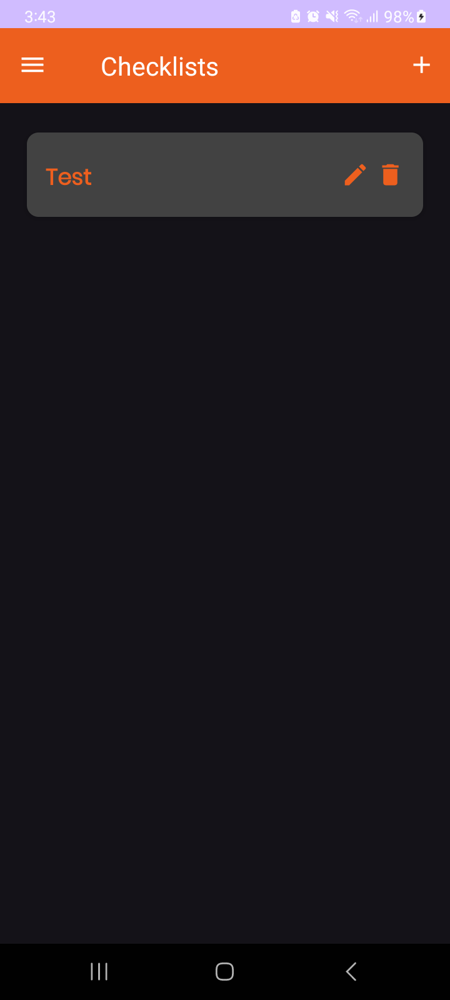

# Simple Note

  
  

A simple note taking app with other features such as checklist, reminder and progress tracker

## Preview

|  |  |  |  |  | 
|----------------------------|:------------------------------------:|:-----------------------------------------:|:----------------------------------:|:-----------------------------------:|

## Tech stack & Libraries

- [Kotlin](https://kotlinlang.org/) - Modern native Android programming language.
- [XML](https://developer.android.com/guide/topics/ui/declaring-layout) - Used for designing the UI.
- [SQLite](https://developer.android.com/training/data-storage/sqlite) - Lightweight relational database for local data persistence.
- [MPAndroidChart](https://github.com/PhilJay/MPAndroidChart) - Library for creating charts and graphs.
- [Broadcast Receiver](https://developer.android.com/guide/components/broadcasts) - Used for notification for reminder feature.

## Features

* **Note Taking:** Create and edit text notes.
* **Checklist Taking:** 
  * Create checklists with multiple items.
  * Mark items as complete.
* **Reminders:**
  * Set reminders for tasks or events.
  * Manage and edit reminders.
  * Receive notifications for reminders.
* **Progress Tracker:**
  * Manually track progress on tasks or goals.
  * Visualize progress with a pie chart.
